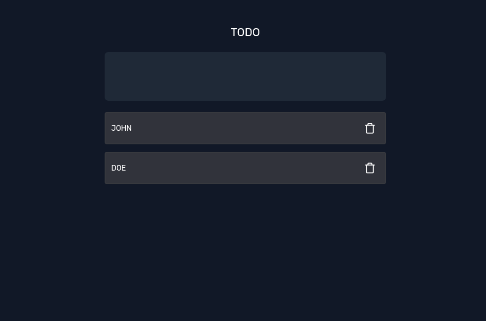

# Getting Started

This is simple todo app, covered test cases with React Testing Library.



### Installation

1. Install NPM packages
   ```sh
   npm install @testing-library/jest-dom @testing-library/react @testing-library/user-event @types/jest
   ```

### Step

1. Setup render function
   ```tsx
    const setup = () => {
    const utils = render(<App />);
    const input = utils.getByLabelText("Todo Input") as HTMLInputElement;
    const getTodolist = () =>
      screen
        .getAllByTestId("todo_list")
        .map((item) => within(item).getByTestId("todo_content").textContent);
    return {
      input,
      getTodolist,
      ...utils,
    };
   };
   ```

2. Test input field
   ```tsx
    it("Checking input field value change", () => {
      const { input } = setup();
      fireEvent.change(input, { target: { value: "23" } });
      expect(input.value).toBe("23");
    });
   ```

3. Add todo to the list
   ```tsx
   it("Add Todo item to the list", () => {
     const { input, getTodolist } = setup();
     const userInput = `fdsafwe vdsagvgsa`;
     userEvent.type(input, `${userInput}{enter}`);
     expect(getTodolist().findIndex((content) => content === userInput)).toBe(0);
   });
   ```

3. Test delete button
   ```tsx
   it("Remove todo item from the list", () => {
    const { input, getTodolist } = setup();
    const userInput = [`fdsafwe vdsagvgsa`, "abc", "yuijeiojo"];
    const todoValueWantToDelete = "abc";
    for (const item of userInput) {
      userEvent.type(input, `${item}{enter}`);
    }
    const deleteButton = screen.getAllByTestId("todo_list").filter((item) => {
      if (
        within(item).getByTestId("todo_content").textContent ===
        todoValueWantToDelete
      ) {
        return within(item).getByTestId("todo_delete_button");
      }
      return false;
    });
    expect(deleteButton.length).toBeGreaterThan(0);
    deleteButton[0].click();
    expect(
      getTodolist().findIndex((content) => content === todoValueWantToDelete)
    ).toBe(1);
   });
   ```
